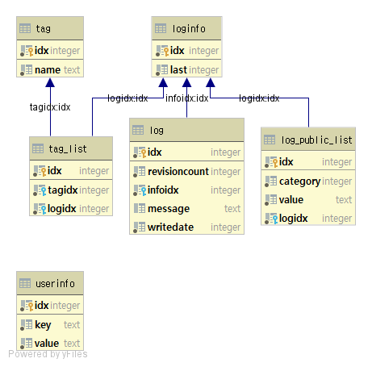

# 로그저장소 - 메인 모듈 (LogStorage - Core)
* 로그저장소의 핵심 기능을 담당하는 프로젝트.
* 다음과 같은 환경으로 개발하고 있다.
  * 언어 : 파이썬 3.7
  * DB : SQLITE

## DB 구조
* 구조는 다음과 같다.
* 설명에서 idx는 순번이므로 제외시켰다.

### userinfo
|논리명|물리명|설명|
|--|--|--|
|키|key|사용자정보의 제목이 들어간다|
|값|value|사용자정보의 값이 들어간다|
* 사용자의 정보를 담당하는 테이블.
* id와 password는 필수정보이며,  그 외 추가 정보들이 들어간다.

### loginfo
|논리명|물리명|설명|
|--|--|--|
|마지막리비전|last|가장 최근의 리비전|
* 로그저장소의 기록들은 기본적으로 수정이 가능하며, 이전 값들의 이력을 가지고 있어야하기때문에 이런 구조가 필요하다고 판단하였다.

### log
|논리명|물리명|설명|
|--|--|--|
|리비전번호|revisioncount|리비전번호|
|로그인포번호|infoidx|로그인포번호|
|로그내용|message|로그내용. 기본적으로 마크다운을 사용한다.|
|작성일|writedate|유닉스타임스탬프로 이루어진 작성시각|
* 근본적인 로그의 데이터.
* 기본적으로 작성시각을 기준으로 정렬하나, 태그에 의해 다르게 정렬될 수 있다.
* 리비전 횟수가 가장 최근의 것만 표기되며, 추후 자세한 정보를 볼때 이전 기록을 볼 수 있다.
* 기본적으로 삭제는 불가능하다.

### log_public_list
|논리명|물리명|설명|
|--|--|--|
|분류|category|공개범위 분류|
|공개대상|value|공개 대상|
|로그인포번호|logidx|로그인포번호|
* 공개수준은 상황에따라 다르기때문에, 다음과 같이 우선적으로 정한다.
  * 크게 3가지가 있음.
    * 1 : 특정 대상 공개
      * ID를 입력할 시 그 사용자에게만 공개 됨
    * 2 : 특정 그룹 공개
      * 그룹명을 입력할 시 그 그룹에게 공개 됨
    * 3 : 전체 공개
      * 모두에게 공개 됨
  * 추후 보완이 더 필요하긴 하나, 로컬이 아닌 웹에서 사용할때 사용되는 서비스이다.
* 공개대상은 위에 항목에 따라 입력값이 다르게 들어온다. (전체공개일 경우 뭐가 들어와도 상관 없음)

### tag
|논리명|물리명|설명|
|--|--|--|
|태그명|name|태그명|
* 로그저장소는 분류가 없을 시, 날짜별로 분류가 가능하나, 태그를 이용해 프로젝트별, 분기별 등등 다양하게 조회가 가능하다.

### tag_list
|논리명|물리명|설명|
|--|--|--|
|태그번호|tagidx|태그번호|
|로그번호|logidx|로그번호|
* 로그별로 다중 태그가 붙기때문에 이렇게 따로 테이블을 넣었다.

## 기본 기능
* Core가 하는 기본 기능은 다음과 같다.

* ### 사용자 생성
  * 사용자를 생성한다
  * ID와 PW를 기본적으로 입력받아 생성한다
  * ID와 PW를 입력받으면, 위의 테이블 구조가 같이 생성되며, 파일명은 사용자ID로 설정된다.

* ### 로그 작성 
  * 메시지대로 로그를 생성한다.
  * 공개 수준에 사용자 본인을 추가한다

* ### 로그 수정
  * 로그를 수정한다.
  * 새로운 log 칼럼을 생성하고, loginf에서 디비전 카운트를 올린다.

* ### 로그 조회(검색)
  * 로그를 조회한다
  * 이때 검색어에 따라 내용이 바뀐다
  * 검색어가 없으면 당일의 모든 로그를 조회한다
  * 검색어 분류는 다음과 같다
    * 텍스트 : 로그에 해당 텍스트가 있는것만 조회한다
    * 태그 : #으로 구분되며, 해당 태그가 붙어있는 로그만 조회한다
    * 기간 : %으로 구분되며, 해당 기간의 로그만 조회한다
  * 위의 검색 조건들은 모두 or, and 연산이 가능해야 한다
  
* ### 태그 생성/삭제
  * 태그를 생성하고 삭제할 수 있다.
  * 태그 삭제는 해당 태그를 사용하지 않을때만 가능하다